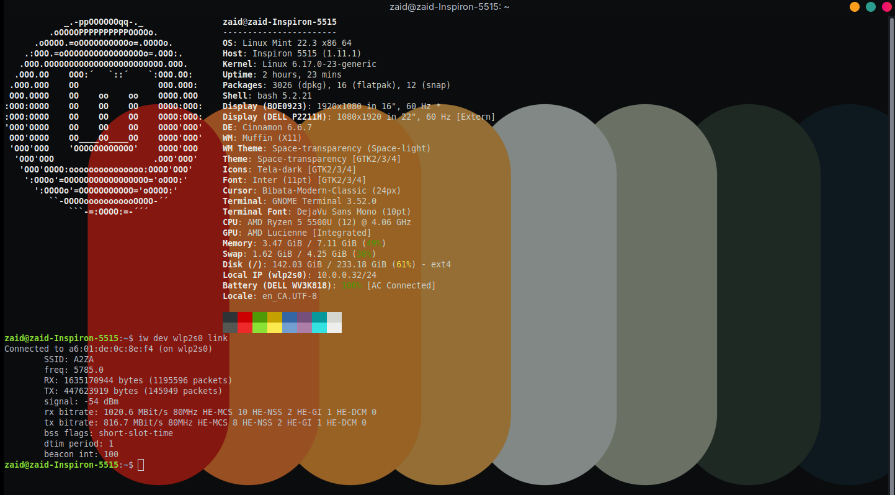

# mac80211-htfix

Restored Wi-Fi 6 throughput from **54 Mbps to 864 Mbps** — a 16× improvement — by patching a one-line kernel assumption in Linux's `mac80211` HT MCS validation path that silently falls back to legacy 802.11g on routers with malformed beacon advertisements.

> **Note:** Secure Boot must be disabled for the DKMS module to load.

---

## Is this your problem?

You probably have this bug if all of the following are true:

- You're on Linux (Ubuntu, Fedora, etc.)
- Your WiFi shows **54 Mbps** or similar suspiciously low speeds despite having a modern adapter
- You're connected to a **Comcast/Xfinity XB10** or **Rogers XB10** gateway (or another ISP-provided router)
- Your adapter is driven by `mac80211` — most common ones are (Intel, Realtek, Atheros)
- The same router gives Windows or macOS devices full speeds

To confirm, run:

```bash
iwconfig 2>/dev/null | grep -i "bit rate"
```

If you see something like `Bit Rate=54 Mb/s` while other devices on the same router are getting 300–900+ Mbps, this patch is likely your fix.

You can also check which driver your adapter uses:

```bash
iw dev | grep Interface   # get your interface name, e.g. wlan0
ethtool -i wlan0          # replace wlan0 with your interface
```

If the driver is `iwlwifi`, `ath9k`, `ath10k`, `rtw88`, or similar — you're using `mac80211` and this applies to you.

---

## Why this happens

Some ISP gateways broadcast a malformed **HT Operation basic MCS set** in their WiFi beacons — advertising optional MCS rate indices (33–76) that virtually no consumer card actually supports.

Linux's `mac80211` layer takes this advertisement at face value. It concludes your card can't meet the router's stated minimum requirements and silently falls back to **legacy 802.11g mode: 54 Mbps** — the speed of 2003-era hardware. Your card and router are both fully Wi-Fi 6 capable; they just can't agree because of the router's broken beacon.

Windows and macOS don't hit this because their drivers are more lenient about beacon compliance.

---

## The fix

The VHT codepath in `mac80211` already skips this check for non-strict hardware. This patch applies the same logic to HT connections — one line in `mlme.c`:

```c
/* Skip basic MCS check for non-strict hardware (e.g. Intel AX200).
   Mirrors the existing VHT bypass to avoid falling back to 54 Mbps
   on routers with broken beacon MCS advertisements (XB10 gateways). */
if (!ieee80211_hw_check(&sdata->local->hw, STRICT))
    return true;
```

The change is minimal and targeted: it only affects non-strict adapters, and only in the HT basic MCS validation path.

---

## Results

| | Speed |
|:---|:---|
| **Before patch** | 54 Mbps (legacy 802.11g fallback) |
| **After patch** | 864 Mbps (Wi-Fi 6, 80 MHz, 2×2 MIMO) |

### Before



### After


---

## Install

This is packaged as a DKMS module, so it rebuilds automatically whenever you update your kernel.

**1. Clone the repo**

```bash
git clone https://github.com/zaid/mac80211-htfix.git
cd mac80211-htfix
```

**2. Install the DKMS module**

```bash
sudo cp -r . /usr/src/mac80211-htfix-1.0
sudo dkms add mac80211-htfix/1.0
sudo dkms build mac80211-htfix/1.0
sudo dkms install mac80211-htfix/1.0
```

**3. Reload the module**

```bash
sudo modprobe -r mac80211 && sudo modprobe mac80211
```

Your WiFi will reconnect at full speed — no reboot required.

**4. Verify**

```bash
iwconfig 2>/dev/null | grep -i "bit rate"
```

You should now see a rate in the hundreds of Mbps instead of 54.

---

## Tested on

- **OS:** Ubuntu 24.04
- **Kernel:** 6.17.0-22-generic
- **Adapter:** Intel AX200 (Wi-Fi 6)
- **Router:** Rogers XB10 gateway

Should work on any kernel 5.x/6.x with a non-strict `mac80211` adapter. If you test it on a different setup, feel free to open an issue with your results.

---

## Files

| File | Description |
|:---|:---|
| `0001-mac80211-bypass-HT-MCS-check-for-non-strict-hardware.patch` | The patch |
| `dkms.conf` | DKMS build/install configuration |
| `mlme.c` + supporting sources | Patched mac80211 source (kernel 6.17) |
